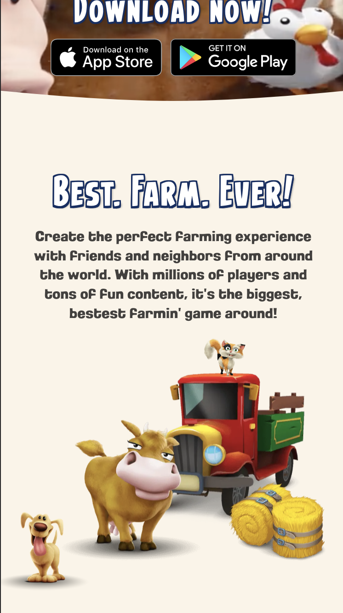

# Procesverslag
Markdown is een simpele manier om HTML te schrijven.  
Markdown cheat cheet: [Hulp bij het schrijven van Markdown](https://github.com/adam-p/markdown-here/wiki/Markdown-Cheatsheet).

Nb. De standaardstructuur en de spartaanse opmaak van de README.md zijn helemaal prima. Het gaat om de inhoud van je procesverslag. Besteedt de tijd voor pracht en praal aan je website.

Nb. Door *open* toe te voegen aan een *details* element kun je deze standaard open zetten. Fijn om dat steeds voor de relevante stuk(ken) te doen.

## Jij

  
uitwerken voor kick-off werkgroep

  ### Auteur:
  Kim Bras

  #### Je startniveau:
  Blauw

  #### Je focus:
  Surface plane
 

## Je website

  
uitwerken voor kick-off werkgroep

  ### Je opdracht:
  [hayday.com](https://hayday.com/en)

  #### Screenshot(s) van de eerste pagina (small screen): 
  HayDay home
  
  

  #### Screenshot(s) van de tweede pagina (small screen):
 Hay Day find out more pagina 
  
  

 

## Toegankelijkheidstest 1/2 (week 1)

  
uitwerken na test in 2e werkgroep

  ### Bevindingen
  Lijst met je bevindingen die in de test naar voren kwamen:

Screenreader
- Na de test kwam vooral naar voren dat plaatjes geen alt hebben waardoor je niet kan weten wat de afbeeldingen zijn.
- Ook werden paragrafen niet in ene opgelezen maar moest je elke keer naar beneden klikken om de rest van de regels tekst te laten voorlezen. 
- De linkjes werden ook niet opgenoemd waar je dan heen zou gaan, er werd alleen gezegt dat je op een linkje staat. 

WCAG checklist
- Tijdens de WCAG checklist ben ik erachter gekomen dat ze hun code niet mooi hebben opgemaakt, zo gebruiken  ze alleen maar div.
- Ook hebben ze geen url bij img.
- Gebruiken ze geen button tags voor buttens.
- Hebben ze meerdere H1 op 1 pagina. 

## Breakdownschets (week 1)

  
uitwerken na afloop 3e werkgroep

  ### de hele pagina: 
  

## Voortgang 1 (week 2)

  
uitwerken voor 1e voortgang

  ### Stand van zaken
  hier dit ging goed & dit was lastig (neem ook screenshots op van delen van je website en code)

  ### Agenda voor meeting
  samen met je groepje opstellen
 
  | Choice         | Debora             | Jelle        | Kim               |
  | ---            | ---                | ---          | ---               |
  | was er niet    |  HTML              | HTML         | HTML              |  
  |                |                    |              | github error      |
   

  ### Verslag van meeting
Punten die uit de meeting zijn gekomen waar ik op moet letten zijn:

- Taal aanpassen bij de alt tags zodat het engels is.
- Als de taal wel nederlands is dan moet je een nederlands tag erbij doen
- Span niet doen
- De img van App Store en Play Store zijn a tags en niet img tags. 
- Verder heeft Sanne me geholpen met het gebruiken van grid.

## Voortgang 2 (week 3)

  
uitwerken voor 2e voortgang

  ### Stand van zaken
  hier dit ging goed & dit was lastig (neem ook screenshots op van delen van je website en code)

  ### Agenda voor meeting
  samen met je groepje opstellen

 | Choice         | Debora                  | Jelle        | Kim                 |
  | ---            | ---                    | ---          | ---                 |
  | HTML           |  tekst bepaalde plek   | Svg bestandje| hoe fix ik de gaten |  
  |                |                        |              | github error        |
   
  ### Verslag van meeting
  hier na afloop snel de uitkomsten van de meeting vastleggen

- Foto’s moet ik kijken of dat veel ruimte inneemt heeft te maken met de translate 
- Figure gebruiken ipv article.
- Clame gebruiken voor bepaalde lettertypes van Websemantics.uk

## Toegankelijkheidstest 2/2 (week 4)

  
uitwerken na test in 9e werkgroep

  ### Bevindingen
  Lijst met je bevindingen die in de test naar voren kwamen (geef ook aan wat er verbeterd is):

Tijdens de test kwam ik erachter dat ik ondanks dat ik dacht dat de site bijna klaar zou zijn erachter dat ik nog meerder dingen moest doen zoals:
- ik heb nog gekeken naar mijn footer want die stak nog een stuk uit waardoor je horizontaal kan scrollen.
- ik heb een focus stijl nog toegevoegd.
- ook kwam ik erachter dat de video een autoplay heeft, die heb ik laten staan met overleg van Sanne, dat is meer een oplossing voor een ander moment
- voor de autoplay moet er een reduce motion komen wat een andere keer opgelost moet worden
- een skip link is voor mijn pagina niet nodig, omdat het geen header heeft dus dat is daarom een beetje onnodig.
- ook ga ik kijken naar een oplossing om mijn 2e pagina in een apart scherm in de laten komen. 

## Voortgang 3 (week 4)

  
uitwerken voor 3e voortgang

  ### Stand van zaken
  hier dit ging goed & dit was lastig (neem ook screenshots op van delen van je website en code)

  ### Agenda voor meeting
  samen met je groepje opstellen

  Choice                 | Debora                  | Jelle         | Kim             
  | ---                  | ---                     | ---            | ---                |
  | HTML                 |  Blokken gelijk krijgen | Blokken gelijk | Horizontale scroll |  
  | Website laten zien   |                         |                | scroll animatie    |

  ### Verslag van meeting
  hier na afloop snel de uitkomsten van de meeting vastleggen
  
  - wat ik heb geleerd is het volgende : hidden te schrijven
  - ook heb ik geleerd hoe ik een scroll animatie kan maken via https://scroll-driven-animations.style/demos/image-reveal/css/
  - met de hand van keyframes kan ik een animatie maken
  - kleuren light en dark mode heeft hij laten zien

## Eindgesprek (week 5)

  
uitwerken voor eindgesprek

  ### Je uitkomst - karakteristiek screenshots:
  

  ### Dit ging goed/Heb ik geleerd: 
 Ik heb geleerd om met grid om te gaan en hiervoor verschillende schermen te maken. Ook vond ik het black and light functie heel intersant wat ik heb geleerd. 

  
  
  

  
  

  ### Dit was lastig/Is niet gelukt:
Wat niet is gelukt is het helemaal responsive maken van de website, soms vallen de teksten nog over elkaar heen. Dit heb ik zo veel mogelijk proberen op te lossen.

  

  ### Ingevulde WCAG checklist:
  <iframe src="readme-image/WCAG_Checklist.pdf" width="600" height="500"></iframe>
  <figcaption>Ingevulde WCAG checklist</figcaption> <!-- chatgpt -->

## Bronnenlijst

  
continu bijhouden terwijl je werkt

  Nb. Wees specifiek ('css-tricks' als bron is bijv. niet specifiek genoeg). 
  Nb. ChatGpT en andere AI horen er ook bij.
  Nb. Vermeld de bronnen ook in je code.

  1. [bron 1](https://websemantics.uk/tools/responsive-font-calculator/?utm_source=pocket_saves)
  2. [bron 2](https://www.w3schools.com/w3css/w3css_slideshow.asp)
  3. [bron 3](https://blog.webdevsimplified.com/2022-01/intersection-observer/)
  4. [bron 4](https://www.w3schools.com/w3css/w3css_slideshow.asp)
  5. [bron 5](https://developer.mozilla.org/en-US/docs/Web/HTML/Element/dialog)
  6. [bron 6](https://openai.com/chatgpt/)

